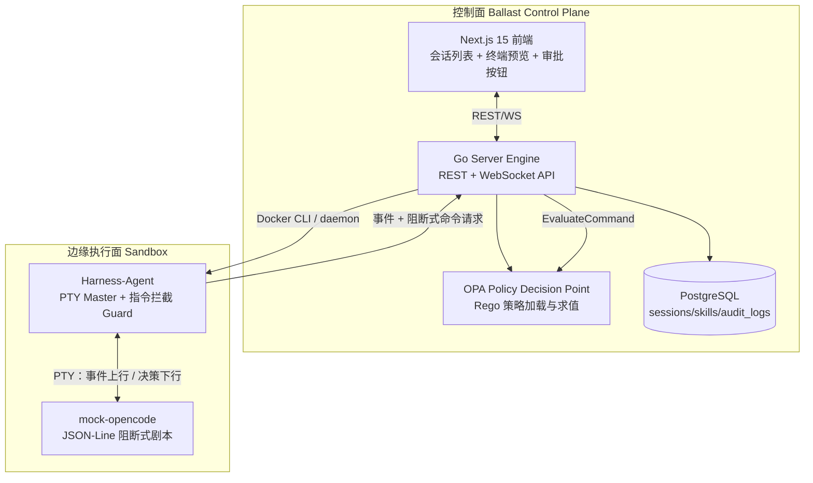

# Ballast

> AI 时代云原生基础设施的安全自愈与演进底座（Harness）。
> 让每一家企业都敢于、合规地、无风险地在生产环境释放大模型智能体的生产力。

Ballast 解决"AI 引擎高效率"与"生产环境高风险"之间的终极矛盾：
视 OpenCode 为最锋利的"矛"（极致执行与代码重构力），视 Ballast 为最坚固的"盾"
（物理沙箱与指令级熔断网关）。唯有盾足够坚固，矛才敢放手冲锋。

完整理念与产品需求见 [`spec/INIT.md`](spec/INIT.md)。

---

## 当前版本：v0.2 — 自动化与资产中枢闭环

当前版本打通"控制面 → 自动化触发 → 隔离沙箱 → Skill/MCP 资产注入 → 变更策略拦截 →
人工断点审批 → 全量审计"的闭环。默认执行引擎仍以可验证的 **mock-opencode** 剧本运行；
同时已提供 **real-k8s** 真实场景 runner：沙箱内使用真实 `kubectl` 访问真实 Kubernetes API，
对 CrashLoopBackOff Deployment 执行只读诊断、审批后 `kubectl apply` 修复，并写入完整审计。
也已提供 **git-pr** 真实工作区 runner：将宿主机 Git/IaC 目录挂入沙箱，自动读取变更，并在审批后
创建分支、提交、可选推送远端并生成 PR/MR 创建链接。
真实 `opencode serve` 的 HTTP/SSE client adapter 也已落地，企业环境可在沙箱镜像中安装真实 CLI 后接入。

### 当前范围

| 模块 | 状态 | 说明 |
| --- | --- | --- |
| Go 控制面后端 | ✅ | REST + WebSocket，`server/` |
| Next.js 15 前端工作区 | ✅ | 会话列表 + 三栏布局（Reason Tree / Xterm.js / Approve），`web/` |
| PostgreSQL 数据层 | ✅ | sessions / trigger_rules / skills / audit_logs / mcp_plugins，`server/migrations/` |
| SandboxRuntime SPI + Docker | ✅ | 接口 + Docker 实现，E2B 留作扩展点，`server/internal/runtime/` |
| Harness-Agent（PTY 劫持 + 指令拦截） | ✅ | `harness-agent/`，gRPC proto 契约已定义，v0.1 通信走 HTTP JSON |
| OPA 策略引擎 | ✅ | Rego 热加载，三决策路径（APPROVE/DENY/SUSPEND）单测覆盖，`server/internal/policy/` |
| Skill 资产与挂载 | ✅ | REST 管理 `SKILL.md`，手工会话可按 `skill_ids` 只读挂载到沙箱 `/workspace/.opencode/skills/` |
| Git/IaC 工作区挂载 | ✅ | 手工会话可传 `workspace_dir`，宿主机目录读写挂载到沙箱 `/workspace/project` |
| Trigger Rule 自动化 | ✅ | REST 管理路由资产；内部 Webhook 入口与 Cron 调度可按规则自动拉起沙箱 |
| MCP 插件中心基础能力 | ✅ | REST 管理 MCP 插件，生成 `mcp_config.json` 并只读挂载到沙箱 |
| OpenCode HTTP/SSE client | ✅ | `server/internal/opencode/client` 实现 `Engine`，支持 session / prompt / event / MCP 注入 |
| Mock OpenCode 引擎 | ✅ | 沙箱内 JSON-Line 剧本；每条工具调用须等待 Harness 决策，`sandbox-image/mock-opencode` |
| 真实 K8s runner | ✅ | `ballast-real-k8s-runner` 使用真实 kubectl + kubeconfig 访问真实 K8s API |
| Git PR runner | ✅ | `ballast-git-pr-runner` 面向真实 Git 工作区，审批后 branch/add/commit，可选 push 与 PR URL |
| 沙箱基础镜像 | ✅ | 预装 harness-agent、mock-opencode、real-k8s runner、git-pr runner、真实 kubectl，`sandbox-image/` |
| 认证与边界 | ✅ | HttpOnly 控制台会话、内部 Bearer Token、CORS/WS Origin 校验 |
| 审计中心基础能力 | ✅ | 审计落库 + 会话审计 API + 工作区 Audit Trail |
| 事件回放 | ✅ | `ballast_session_events` 持久化 Reason/TTY/Policy 事件，历史会话可回放 |
| 人工接管 | ✅ | 控制台可在当前沙箱执行接管命令；仍经 OPA 判定并审计 |
| 资产编辑器 | ✅ | `/assets` 提供 Skill / Trigger Rule / MCP JSON 编辑与发布 |
| 审批通知 | ✅ | 支持 generic / Feishu(Lark) / DingTalk webhook 审批提醒 |
| 端到端闭环 | ✅ | 创建 / Webhook → Skill+MCP 挂载 → Docker 沙箱 → 写操作挂起 → 精确审批 → 审计 → 自动销毁 |

### 仍需外部生产系统接入的扩展点

Vault JIT 真实对接、控制面 ↔ Harness gRPC 双向流替换、真实 OpenCode CLI 镜像打包、
E2B Firecracker Runtime、ClickHouse 高并发审计下沉、多模型分发与跨租户隔离。
详见 [`docs/roadmap.md`](docs/roadmap.md)。

---

## 架构



---

## 目录结构

```
Ballast/
├── spec/INIT.md                       # 项目核心基石文档（理念/PRD/架构/详细设计/配置）
├── docs/
│   ├── opencode-protocol-research.md  # OpenCode 协议调研 spike 产出
│   └── roadmap.md                     # 后续路线图
├── server/                            # Go 控制面后端
│   ├── cmd/ballast-server/            # 入口
│   ├── internal/
│   │   ├── automation/                # Webhook/Cron 触发执行
│   │   ├── api/                       # REST + WebSocket handlers
│   │   ├── config/                    # ballast.yaml 解析
│   │   ├── domain/                    # 领域模型（Session/Skill/AuditLog）
│   │   ├── orchestrator/              # 会话生命周期编排 + WS Hub
│   │   ├── policy/                    # PolicyEngine 接口 + OPA 实现
│   │   ├── opencode/                  # OpenCode Engine 接口 + HTTP/SSE client
│   │   ├── runtime/                   # SandboxRuntime SPI + Docker 实现
│   │   ├── store/                     # PostgreSQL 数据访问层（pgx）
│   ├── migrations/                    # 嵌入式、有序 PostgreSQL migrations
│   └── configs/ballast.yaml           # 主配置样例
├── harness-agent/                     # 沙箱内侧插桩网关
│   ├── cmd/harness-agent/
│   ├── internal/pty/                  # PTY master 劫持（creack/pty）
│   ├── internal/guard/                # 指令拦截 + 控制面上报
│   └── internal/proto/harness.proto   # gRPC 契约（v0.2 启用）
├── sandbox-image/                     # 沙箱基础镜像
│   ├── Dockerfile                     # 预装 harness-agent + mock/real-k8s/git-pr runners
│   ├── mock-opencode                  # PTY 阻断剧本 + 可选 HTTP/SSE 协议预览
│   ├── ballast-real-k8s-runner        # 真实 Kubernetes CrashLoopBackOff runner
│   ├── ballast-git-pr-runner          # 真实 Git/IaC 工作区提交 runner
│   └── .opencode/skills/              # Skill 挂载点样例
├── policies/                          # OPA Rego 策略文件
│   └── k8s_prod_write_intercept.rego  # spec 中的样例策略
├── web/                               # Next.js 15 前端
│   ├── app/
│   │   ├── sessions/page.tsx          # 会话列表
│   │   └── sessions/[id]/page.tsx     # 三栏工作区
│   ├── components/                    # ReasonTree / Terminal(xterm) / ApproveBar
│   └── lib/api.ts                     # API + WS 客户端
├── docker-compose.yml                 # PostgreSQL + Server + Web 本地一键起
├── scripts/e2e-smoke.sh               # 认证/策略/审批/审计/销毁端到端验证
└── Makefile                           # make backend / frontend / sandbox-image / dev / test
```

---

## 本地起服务

需要：Go 1.26.4+、Node 22+、Docker（用于沙箱镜像与 compose）。

```bash
# 1. 拉依赖
cd server && go mod tidy && cd ..
cd harness-agent && go mod tidy && cd ..
cd web && npm install && cd ..

# 2. 全栈起（同时构建沙箱镜像）
docker compose up -d --build
# 或仅起数据库，后端/前端本机直跑：
docker compose up -d postgres
make backend-run   # -> http://localhost:8080
make frontend-dev  # -> http://localhost:3000

# 3. 也可单独构建沙箱基础镜像
make sandbox-image
```

打开 http://localhost:3000，使用开发管理令牌 `ballast-dev-admin-token` 登录。
点击“拉起沙箱会话”后：Mock 引擎输出 Reason Tree → 两条只读命令自动放行 →
`kubectl apply` 触发 SUSPEND → 右侧 Approve 精确放行该命令 → 审计落库 →
会话成功并自动物理销毁沙箱。

会话列表页还提供轻量资产面板：可写入示例 Skill / Trigger Rule / MCP Plugin，并在拉起
手工会话时选择 Skill 与 MCP；也可以填写一个宿主机 Git/IaC 工作区绝对路径作为 `workspace_dir`。
选中的 `SKILL.md` 与 `mcp_config.json` 会由控制面物化到
`runtime_provider.config.workspace_root`，
并以只读目录挂载进沙箱；`workspace_dir` 会以读写方式挂载到 `/workspace/project`。
通过 Docker socket 运行 compose 时，工作区路径必须对控制面容器与宿主 Docker daemon 使用同一路径；
默认 compose 已将 `/tmp/ballast/sandboxes` 按相同路径挂载，因此本地验证建议把测试仓库放在该目录下。

默认令牌仅用于本地开发。部署前必须通过环境变量覆盖
`BALLAST_JWT_SECRET`、`BALLAST_ADMIN_TOKEN`、`BALLAST_INTERNAL_TOKEN`，
并在 TLS 入口后启用 `cookie_secure`。

审批通知可通过环境变量启用：

```bash
export BALLAST_APPROVAL_WEBHOOK_URL=https://example.com/webhook
export BALLAST_APPROVAL_WEBHOOK_KIND=feishu   # generic | feishu/lark | dingtalk
export BALLAST_CONSOLE_BASE_URL=http://localhost:3300
```

当策略返回 `SUSPEND` 时，Ballast 会向 webhook 发送会话、命令和控制台链接；未配置 URL 时保持 no-op。

### 切到真实 Kubernetes 场景

如果你本机已有可从 Docker 容器访问的 Kubernetes 集群，可直接指定 kubeconfig：

```bash
export BALLAST_RUNNER_COMMAND=/usr/local/bin/ballast-real-k8s-runner
export BALLAST_KUBECONFIG=/absolute/path/to/kubeconfig
export BALLAST_KUBE_NAMESPACE=ballast-demo
export BALLAST_KUBE_TARGET_SELECTOR='app=crashloop-demo'
export BALLAST_KUBE_TARGET_DEPLOYMENT=crashloop-demo
export BALLAST_KUBE_FIX_CONFIGMAP=crashloop-demo-config

docker compose up -d --build sandbox-image ballast-server web
```

`BALLAST_KUBECONFIG_REWRITE_LOCALHOST=true` 默认开启，会把 kubeconfig 中的
`127.0.0.1` / `localhost` API Server 地址改写为 `host.docker.internal`，便于沙箱容器访问
kind/minikube/k3s 这类本地集群。

如果你还没有集群，可以一键启动一个真实 k3s demo：

```bash
make real-k8s-demo

export BALLAST_RUNNER_COMMAND=/usr/local/bin/ballast-real-k8s-runner
export BALLAST_KUBECONFIG=/tmp/ballast/real-k8s/kubeconfig.sandbox.yaml
export BALLAST_REAL_K8S_ROOT=/tmp/ballast/real-k8s

docker compose up -d --build sandbox-image ballast-server web
```

然后在页面拉起会话。执行链路会变成：

1. `kubectl get pods` 读取真实 CrashLoopBackOff Pod；
2. `kubectl logs` 读取真实容器日志；
3. `kubectl describe deployment` 读取真实 Deployment；
4. runner 在沙箱 `/tmp` 生成修复 YAML；
5. `kubectl apply -f /tmp/ballast-k8s-fix.yaml` 被策略拦截为 `SUSPEND`；
6. 你在右侧点击 `Approve 放行`；
7. 沙箱执行真实写操作并用 `kubectl wait` 验证 Deployment 可用；
8. 审计中心记录每一次指令、策略决策和审批人。

停止本地 k3s demo：

```bash
make real-k8s-stop
```

### 切到真实 Git/IaC PR 场景

准备一个对控制面容器和宿主 Docker daemon 都可见的 Git 仓库，例如：

```bash
mkdir -p /tmp/ballast/sandboxes/demo-repo
git -C /tmp/ballast/sandboxes/demo-repo init
```

切换 runner：

```bash
export BALLAST_RUNNER_COMMAND=/usr/local/bin/ballast-git-pr-runner

# 默认只创建本地分支和提交，不推送远端。
# 需要远端 PR/MR 时再显式开启：
# export BALLAST_GIT_PUSH=1
# export BALLAST_GIT_REMOTE=origin
# export BALLAST_GIT_PR_URL_TEMPLATE='https://gitlab.example.com/group/project/-/merge_requests/new?merge_request[source_branch]={branch}'

docker compose up -d --build sandbox-image ballast-server web
```

然后在会话列表页把 `workspace_dir` 填成 `/tmp/ballast/sandboxes/demo-repo` 并拉起会话。执行链路：

1. `git status --short` / `git diff --stat` 读取真实工作区变更；
2. 如果没有未提交变更，会话直接成功结束；
3. 如果有变更，`git checkout -B ...`、`git add -A`、`git commit -m ...` 都会被策略拦截为 `SUSPEND`；
4. 你在控制台审批后，沙箱在挂载仓库内创建分支并提交；
5. 配置 `BALLAST_GIT_PUSH=1` 时，`git push` 同样需要审批，成功后返回 PR/MR 创建链接。

可选环境变量：

| 变量 | 默认值 | 说明 |
| --- | --- | --- |
| `BALLAST_GIT_BRANCH` | 空 | 指定精确分支名；为空时使用 `BALLAST_GIT_BRANCH_PREFIX/session-id` |
| `BALLAST_GIT_BRANCH_PREFIX` | `ballast` | 自动分支名前缀 |
| `BALLAST_GIT_COMMIT_MESSAGE` | `ballast: automated workspace update` | 自动提交信息 |
| `BALLAST_GIT_PUSH` | `false` | 是否推送远端；推送前仍需 Ballast 审批 |
| `BALLAST_GIT_PR_URL_TEMPLATE` | 空 | PR/MR 创建链接模板，`{branch}` 会被 URL encode，`{branch_raw}` 保留原始分支名 |
| `BALLAST_TERRAFORM_VALIDATE` | `false` | 检测到 `.tf` 文件时执行 `terraform validate -no-color`；生产镜像应安装真实 Terraform/OpenTofu |

---

## API 速览

| 方法 | 路径 | 用途 |
| --- | --- | --- |
| `GET` | `/healthz` | 健康检查 |
| `POST` | `/api/auth/login` | 管理令牌换取 HttpOnly 会话 Cookie |
| `POST` | `/api/auth/logout` | 清除控制台会话 |
| `GET` | `/api/sessions?status=&limit=&offset=` | 会话列表 |
| `POST` | `/api/sessions` | 创建会话（拉起沙箱 + 引擎；body 支持 `skill_ids`、`mcp_plugin_ids`、`workspace_dir`） |
| `GET` | `/api/sessions/{id}` | 会话详情 |
| `GET` | `/api/sessions/{id}/audit?limit=100` | 会话审计日志 |
| `GET` | `/api/sessions/{id}/events?limit=500` | 持久化事件回放（Reason/TTY/Policy/Manual） |
| `POST` | `/api/sessions/{id}/approve` | 人工放行被挂起的命令 |
| `POST` | `/api/sessions/{id}/resume` | 等价 approve |
| `POST` | `/api/sessions/{id}/terminal/exec` | 人工接管，在当前沙箱执行一次受 OPA 约束的命令 |
| `POST` | `/api/sessions/{id}/destroy` | 销毁沙箱 |
| `WS` | `/api/sessions/{id}/ws` | 实时事件流（reason.step / tool.call / policy.decision / policy.resumed） |
| `GET` | `/api/skills` | 列出 Skill 资产 |
| `POST` | `/api/skills` | Upsert Skill 资产 |
| `GET` | `/api/skills/{id}` | Skill 详情 |
| `GET` | `/api/trigger-rules` | 列出触发路由资产 |
| `POST` | `/api/trigger-rules` | Upsert 触发路由资产 |
| `GET` | `/api/trigger-rules/{id}` | 触发路由详情 |
| `GET` | `/api/mcp-plugins` | 列出 MCP 插件资产 |
| `POST` | `/api/mcp-plugins` | Upsert MCP 插件资产 |
| `GET` | `/api/mcp-plugins/{id}` | MCP 插件详情 |
| `POST` | `/api/internal/harness/report` | harness-agent guard 上报命令，返回 OPA 决策 |
| `POST` | `/api/internal/harness/event` | harness-agent 上报 Reason/Tool/Result 事件 |
| `POST` | `/api/internal/triggers/webhook/{source}` | 内部 Webhook 触发入口，按 active Trigger Rule 自动创建会话 |

除健康检查与登录外，控制台 API 均要求会话 Cookie；内部 Harness API 要求独立 Bearer Token。

---

## 验证

```bash
# 单元测试、静态检查与前端类型/规则检查
make test
make vet
cd web && npm run build

# 全栈启动后执行真实容器闭环
make e2e-test
```

端到端脚本会验证：匿名访问被拒绝、内部接口鉴权、CORS、Skill/Trigger Rule/MCP 资产 API、
带 Skill+MCP+workspace_dir 创建会话、沙箱内 SKILL.md 与 mcp_config.json 只读挂载、
宿主机 Git 工作区挂载到 `/workspace/project`、Docker 沙箱创建、
两条只读命令自动 APPROVE、写命令 SUSPEND、事件回放 API、人工接管命令、人工精确放行、
DB 与 API 审计计数、Webhook 自动触发会话以及沙箱自动销毁。

---

## 安全红线（来自 spec）

- 无监督/无审批的生产写操作：**绝不**
- OpenCode 直接在管理端宿主机执行本地 Shell：**绝不**
- 全自动黑盒自愈：**绝不**，每一步变更必须可视、可卡口
- 替代人类承担最终法律责任：**绝不**，AI 永远是副驾驶

v0.1 的 Docker Runtime 适用于本地开发和闭环验证。控制面需要访问 Docker daemon，
不应被直接暴露到不可信网络；生产隔离仍应按路线图替换为受管容器平台或 MicroVM Runtime。

---

## License

见 [LICENSE](LICENSE)。
